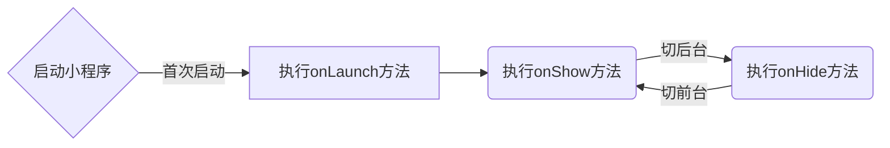

> Transform your plain text into static websites and blogs.

* Toc
{:toc}
### 0. 目录toc

```html
* Toc
{:toc}
或者
[TOC]

我的博客中采用第一种，第二种不兼容GitHub
```


### 1. 标题

```json
# h1
## h2  	// 我的博客文章以h2为最大标题
### h3 	// 我的博客文章以h3为栏目标题
#### h4
##### h5
###### h6
####### h7      // 错误代码
######## h8     // 错误代码
######### h9    // 错误代码
########## h10  // 错误代码
```


### 2. 段落

段落的前后要有空行，所谓的空行是指没有文字内容。  

若想在段内强制换行的方式是使用**两个以上空格加上回车**（引用中换行省略回车）


### 3. 区块引用

> 区块引用 
>
> > > 嵌套引用
> > >
> > > > 三嵌套引用 
> > > >  四嵌套引用

```json
> 区块引用
> > 嵌套引用
> > >三嵌套引用
> > > > 四嵌套引用
```


### 4. 代码区块

```js
​```javascript
var num = 0;
for (var i = 0; i < 5; i++) {
    num+=i;
}
console.log(num);
​```

~~~javascript
var num = 0;
for (var i = 0; i < 5; i++) {
    num+=i;
}
console.log(num);
~~~
```


### 5. 强调
*斜体* ，_斜体_
**加粗**，__粗体__

~~删除文本~~ 

`Ctrl+A` 、`Ctrl+C`、`Ctrl+V`

```js
*斜体* ，_斜体_
**加粗**，__粗体__
~~删除文本~~ 
`Ctrl+A` 、`Ctrl+C`、`Ctrl+V`
```

### 6. 列表

- 无序列表
  + 无序1
  + 无序2
    * 无序2.1

1. 有序列表一
2. 有序列表二
3. 有序列表三

```html
- 无序列表
  + 无序1
  + 无序2
    * 无序2.1

1. 有序列表一
2. 有序列表二
3. 有序列表三
```


### 7. 分割线

夕阳依傍着西山慢慢地沉没，

---

滔滔黄河朝着东海汹涌奔流。

***

若想把千里的风光景物看够，

---

 那就要登上更高的一层城楼。

***

```html
***回车
---回车
```


### 8. 链接

[百度一下，你就知道](https://baidu.com)

```html
[百度一下，你就知道](https://baidu.com)
```


### 9. 图片


```html

```


### 10. 反斜杠

相当于**反转义**作用。使符号成为普通符号


### 11. 注释

某些人用过了才知道[^注释]

[^注释]: Somebody that I used to know.

~~~html
某些人用过了才知道[^注释] [^注释]:Somebody that I used to know.	
~~~


### 12. 表格

| 姓名 | 性别 |   毕业学校   | 工资 |
| :--- | :--: | :----------: | ---: |
| 杨洋 |  男  | 重庆交通大学 | 3200 |
| 峰哥 |  男  |   贵州大学   | 5000 |
| 坑货 |  女  |   北京大学   | 2000 |

```html
|姓名|性别|毕业学校|工资|
|:---|:---:|:---:|---:|
|杨洋|男|重庆交通大学|3200|
|峰哥|男|贵州大学|5000|
|坑货|女|北京大学|2000|
```


### 13. 流程图



<div class='mermaid'>
graph LR
start[启动小程序] -- 首次启动 --> launch(执行onLaunch方法)
launch --> show(执行onShow方法)
show -- 切后台 --> hide(执行onHide方法)
hide -- 切前台 --> show
</div>


### 14.  iframe

<iframe type="text/html" width="100%" height="385" src="https://www.youtube.com/embed/gfmjMWjn-Xg" frameborder="0"></iframe>

```html
<iframe type="text/html" width="100%" height="385" src="https://www.youtube.com/embed/gfmjMWjn-Xg" frameborder="0"></iframe>
```

