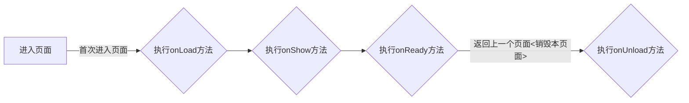

## 微信小程序需要关注一下两种生命周期

- app生命周期
- page生命周期

### 1. app生命周期

```js
//app.js
App({
  /**
  * 应用第一次启动执行，整个应用运行到销毁过程，只会执行一次
  */
  onLaunch: function () {
    console.log('app onLaunch!');
  },
  /**
  * 小程序切换到后台会执行
  */  
  onHide: () => {
    console.log('app onHide!');
  },
  /**
  * 小程序第一次启动进入界面或者从后台切换到前台，都会执行
  */  
  onShow: () => {
    console.log('app onShow!');
  }
})
```

操作流程如图： 


<div class='mermaid'>
graph LR
start[启动小程序] -- 首次启动 --> launch[执行onLaunch方法]
launch --> show{执行onShow方法}
show -- 切后台 --> hide{执行onHide方法}
hide -- 切前台 --> show
</div>


### 2. page生命周期

```js
  /**
  * 监听页面加载
  */
  onLoad: function (options) {
    console.log("onLoad");
  },
  /**
  * 监听页面加载
  */
  onReady: function () {
    console.log("onReady");
  },
  /**
  * 监听页面显示
  */
  onShow: function () {
    console.log("onShow");
  },
  /**
  * 监听页面隐藏
  */    
  onHide: function () {
    console.log("onHide");
  },
  /**
  * 监听页面卸载
  */    
  onUnload: function () {
    console.log("onUnload");
  }
```


#### 2.1  page生命周期
